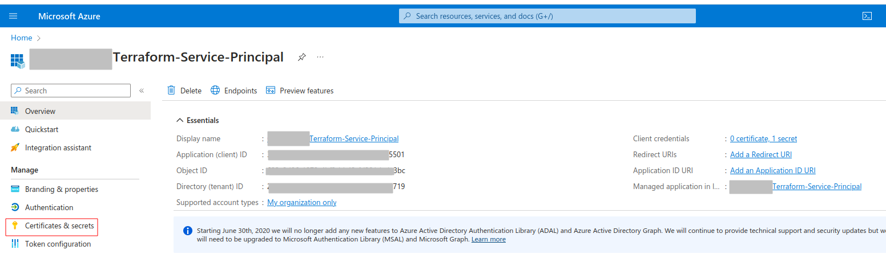
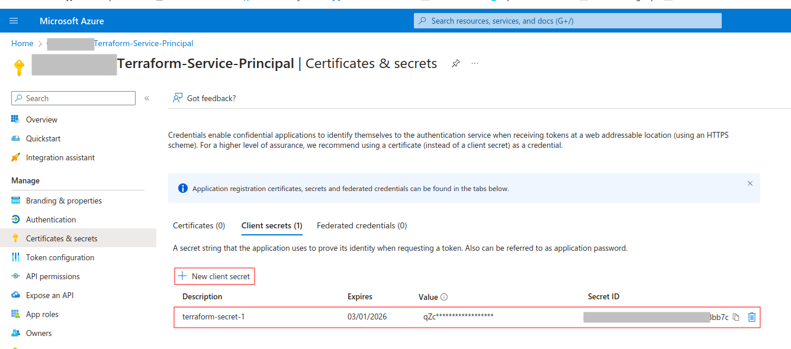
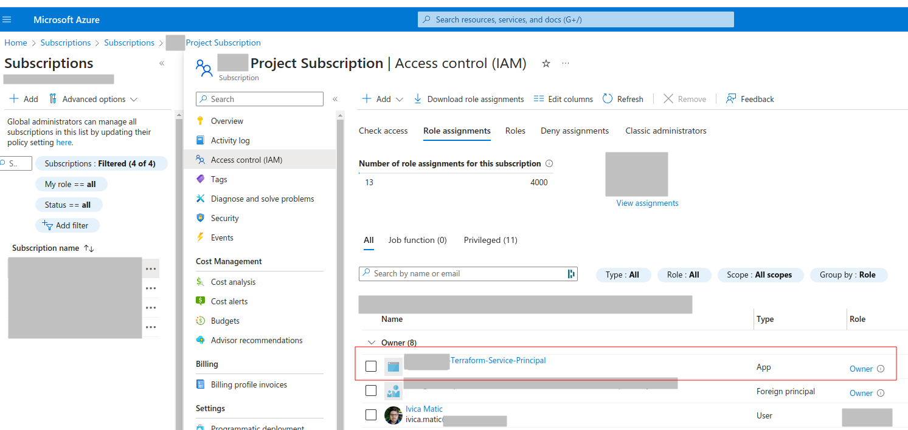
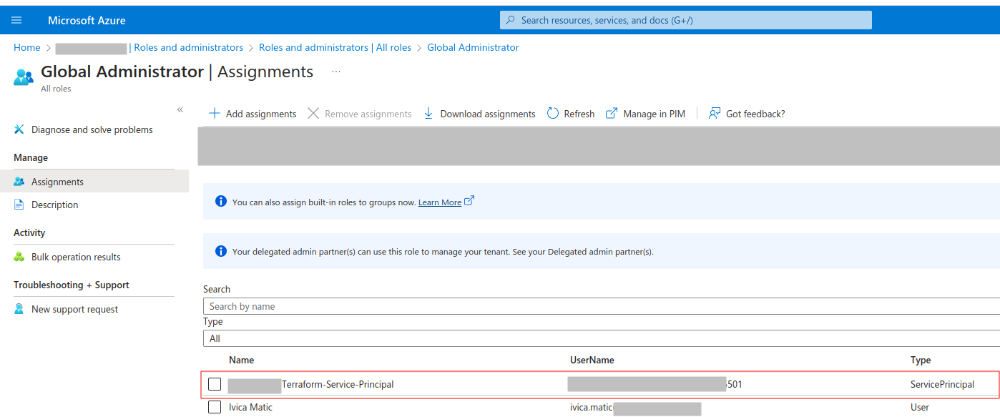

# azurerm-azuread-terraform-template

This repository serves as a centralized location for managing Terraform deployments across different environments using GitHub Actions workflows. These workflows are designed to automate various stages of the Terraform lifecycle, including validation, planning, and applying changes, ensuring consistent and reliable infrastructure deployment.

In addition to azurerm and azuread providers, this repository also includes:

1. Helm provider for managing Kubernetes resources using Helm charts.
2. Kubernetes provider for managing Kubernetes resources directly.
3. Acme provider for managing Let's Encrypt certificates.
4. TLS provider for managing TLS certificates.
5. Random provider for generating random values.

## How to Use

To utilize the workflows in this repository for your own Terraform projects, follow these steps:

1. **Configure Environment Variables:** Begin by setting up the required environment variables in your GitHub repository's secrets. These variables typically include authentication details and configuration specific to your Terraform deployment, such as Azure Subscription ID, Service Principal credentials, and environment-specific settings.

2. **Customize Branch Names:** Review and modify the branch names specified in the workflow files to align with your repository's branching strategy. This ensures that the workflows trigger on the correct branches based on your development and deployment workflow.

3. **Review and Customize Terraform Version:** Examine the specified Terraform version in the workflows and adjust it according to your project's requirements. Ensure that the specified version is compatible with your Terraform configuration to prevent any compatibility issues.

4. **Customize Workflow Triggers (Optional):** Optionally, customize the triggers for each workflow to suit your specific development and deployment processes. You can adjust triggers based on pull requests, pushes to specific branches, or scheduled events to fit your workflow requirements.

5. **Commit and Push:** Once you've customized the workflows to fit your project's needs, commit the changes and push them to your repository. This ensures that the updated workflows are applied to your repository, enabling automated Terraform deployments.

6. **Monitor Workflow Runs:** Keep an eye on the workflow runs in the Actions tab of your GitHub repository. The workflows will automatically trigger on relevant events, providing feedback on Terraform validation, plan generation, and apply processes directly in pull requests or through GitHub issues.

### Generating Terraform Plan in Pull Requests

To facilitate collaboration and ensure that infrastructure changes are thoroughly reviewed, developers can generate Terraform plans by creating pull requests from their feature branches into the target deployment branch. Upon opening a pull request, the GitHub Actions workflows will automatically validate the Terraform configuration and generate a plan for the proposed changes. Developers and reviewers can then inspect the plan to ensure it aligns with expectations and does not introduce any unintended changes. The plan output will be displayed directly in the pull request, providing visibility into the infrastructure modifications before applying them. In the event of plan being too big, the plan is still uploaded as an artifact and can be downloaded from the GitHub Actions run.

### Applying Changes

Once the Terraform plan generated in the pull request has been reviewed and approved, developers can merge the changes into the target branch. Upon merge, the GitHub Actions workflow for applying Terraform changes will be triggered, deploying the approved changes to the target environment. This ensures that only validated and approved changes are applied to the infrastructure, maintaining consistency and reliability across deployments.

## Environment Variables

| Variable Name                       | Description                                                              |
| ----------------------------------- | ------------------------------------------------------------------------ |
| `TF_VAR_SUBSCRIPTION_ID`            | Azure Subscription ID                                                    |
| `TF_VAR_CLIENT_ID`                  | Azure Service Principal Client ID                                        |
| `TF_VAR_CLIENT_SECRET`              | Azure Service Principal Client Secret                                    |
| `TF_VAR_TENANT_ID`                  | Azure Tenant ID                                                          |
| `TF_VAR_STATE_RESOURCE_GROUP_NAME`  | Name of the Azure Resource Group where Terraform state will be stored    |
| `TF_VAR_STATE_STORAGE_ACCOUNT_NAME` | Name of the Azure Storage Account where Terraform state will be stored   |
| `TF_VAR_STATE_CONTAINER_NAME`       | Name of the Azure Storage Container where Terraform state will be stored |
| `TF_VAR_ENVIRONMENT`                | Environment name (e.g., `dev`, `staging`, `prod`)                        |

Ensure that these environment variables are securely stored in your repository's secrets settings to prevent unauthorized access to sensitive information.

## Creating a Service Principal in Azure Portal

To create a Service Principal in the Azure portal, follow these steps:

1. **Navigate to the Azure Portal:** Open your web browser and go to the [Azure Portal](https://portal.azure.com).

2. **Sign in:** Sign in with your Azure account credentials.

3. **Search for App Registrations:** In the Azure portal's search bar, type "App Registrations" and select it from the search results.

4. **Register an Application:** Click on the "New registration" button to register a new application.

5. **Provide Application Details:** Enter a name for your application. You can ignore redirect uri. Then, click on the "Register" button.

6. **Retrieve Application ID and Tenant ID:** Once the application is registered, note down the Application (Client) ID and the Directory (Tenant) ID. These will be used as `TF_VAR_CLIENT_ID` and `TF_VAR_TENANT_ID` respectively.

7. **Create a Client Secret:** In the left-hand menu, under "Certificates & secrets," click on "New client secret." Enter a description, select the expiry duration, and click on the "Add" button. Note down the generated client secret value immediately, as it will not be visible later. This client secret will be used as `TF_VAR_CLIENT_SECRET`.

8. **Assign Role:** Assign the appropriate role to the service principal based on the permissions required for your Terraform deployment. The easiest but not recommended way is to assign the `owner` role directly to the service principal at the subscription level and `global administrator` role at the tenant level. However, this approach grants broad and potentially unnecessary permissions, increasing the risk of accidental or malicious actions. It's recommended to follow the principle of least privilege and assign only the necessary permissions to the service principal.

